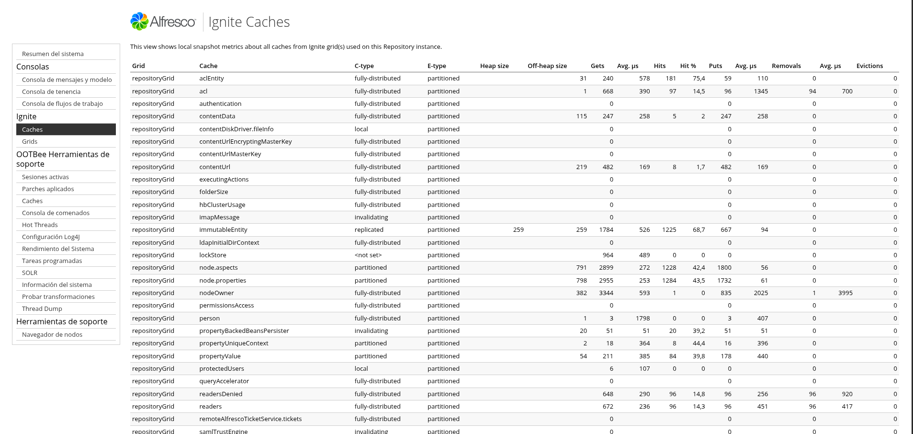
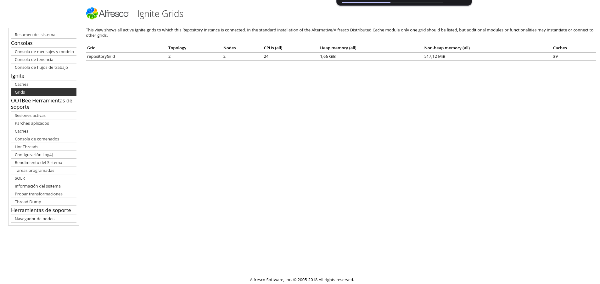

# distributed-caching-community-alfresco  
## Refactor para Java 17 y Apache Ignite 2.17.0

Este proyecto es un FORK del módulo de **ALDICA** basado en **Apache Ignite**, actualizado para funcionar con:

- **Alfresco Content Services 25.x**
- **Java 17**
- **Apache Ignite 2.17.0**
- Despliegue en **Docker** con múltiples nodos Alfresco en clúster.

El objetivo principal del refactor ha sido:

- Migrar a **Ignite 2.17.0**.
- Hacer el módulo compatible con **Java 17 (JPMS)**.
- **Desactivar la autenticación de Ignite** a nivel de plugin personalizado.
- Mantener las páginas de administración de **Caches** y **Grids** en la consola de administración de Alfresco.
- Proveer una forma sencilla de **validar el clúster** (tickets de sesión compartidos entre nodos).

---

## 1. Cambios principales del refactor

### 1.1. Migración a Apache Ignite 2.17.0

Se ha actualizado la dependencia de Ignite a la versión **2.17.0**.  
Esto ha requerido cambios en las clases de integración, especialmente en las relacionadas con seguridad:

- `SimpleSecuritySubject`
- `NoopSecurityContext`
- `NoopSecurityPermissionSet`
- `SimpleSecurityPluginProvider`
- `SimpleSecurityPluginConfiguration`
- `SimpleSecurityProcessor` (ya no se usa en ejecución normal)

Los cambios clave:

- La interfaz `SecuritySubject` en Ignite 2.17.0 ya **no expone `permissions()`** → se mantiene el método como método “propio” de la implementación para compatibilidad con código del proyecto.
- La interfaz interna `SecurityContext` ha cambiado y ya **no tiene** los métodos `taskOperationAllowed`, `cacheOperationAllowed`, etc.  
  Se mantienen en `NoopSecurityContext`, **sin `@Override`**, solo para que el resto del código pueda seguir compilando si los usa.

### 1.2. Desactivación del plugin de seguridad de Ignite

El proyecto original incluía un plugin de seguridad sencillo (`SimpleSecurityPluginProvider` + `SimpleSecurityProcessor`) que validaba las credenciales de nodos y clientes.

En este refactor se ha optado por **desactivar completamente la autenticación de Ignite** a nivel de plugin, con dos efectos:

1. **El proveedor de plugin ya no registra un `GridSecurityProcessor`**:
   - `SimpleSecurityPluginProvider.createComponent(...)` deja de devolver una instancia de `SimpleSecurityProcessor` y devuelve siempre `null`.
   - Esto hace que Ignite arranque **sin capa de seguridad personalizada**.

2. Las clases relacionadas con permisos (`NoopSecurityPermissionSet`, `NoopSecurityContext`) se mantienen solo como **utilidades / compatibilidad**, pero no se usan para bloquear nada:  
   - `NoopSecurityPermissionSet.defaultAllowAll()` devuelve `true`.
   - `NoopSecurityContext` permite todas las operaciones.

Resultado:  
> Ignite se ejecuta **sin autenticación interna** y sin comprobación de permisos desde nuestro plugin.  
> Toda la seguridad se delega a la seguridad propia de la red / despliegue y de Alfresco.

---

## 2. Ajustes de JVM / JPMS (Java 17)

Ignite 2.17.0 utiliza reflexión sobre clases internas de Java y, bajo Java 17, esto requiere **abrir módulos/paquetes** explícitamente.

En el `docker-compose` se han añadido las siguientes opciones a `JAVA_OPTS`:

```
--add-modules java.se
--add-exports=java.base/jdk.internal.ref=ALL-UNNAMED
--add-exports=java.base/sun.nio.ch=ALL-UNNAMED
--add-exports=java.management/com.sun.jmx.mbeanserver=ALL-UNNAMED
--add-exports=jdk.internal.jvmstat/sun.jvmstat.monitor=ALL-UNNAMED
--add-exports=java.base/sun.reflect.generics.reflectiveObjects=ALL-UNNAMED
--add-opens=java.base/java.nio=ALL-UNNAMED
--add-opens=java.base/java.lang=ALL-UNNAMED
--add-opens=java.base/java.io=ALL-UNNAMED
--add-opens=java.base/java.util=ALL-UNNAMED
--add-opens=java.base/sun.nio.ch=ALL-UNNAMED
--add-opens=java.base/javax.crypto=ALL-UNNAMED
--add-opens=java.base/jdk.internal.misc=ALL-UNNAMED
--add-opens=java.base/java.util.concurrent=ALL-UNNAMED
--add-opens=java.base/java.lang.invoke=ALL-UNNAMED
--add-opens=java.base/java.lang.reflect=ALL-UNNAMED
--add-opens=java.sql/java.sql=ALL-UNNAMED
--add-exports=java.base/jdk.internal.misc=ALL-UNNAMED
--add-opens=java.management/sun.management=ALL-UNNAMED
--add-opens=java.base/java.util.concurrent.atomic=ALL-UNNAMED
--illegal-access=permit
-XX:+UseG1GC
-XX:+ParallelRefProcEnabled
-XX:+UseStringDeduplication
-XX:+ScavengeBeforeFullGC
-XX:+DisableExplicitGC
-XX:+AlwaysPreTouch
-Dfile.encoding=UTF-8
-Djava.net.preferIPv4Stack=true
-DIGNITE_PERFORMANCE_SUGGESTIONS_DISABLED=true
-DIGNITE_QUIET=true
-DIGNITE_NO_ASCII=true
-DIGNITE_UPDATE_NOTIFIER=false
-DIGNITE_JVM_PAUSE_DETECTOR_DISABLED=true
-DIGNITE_SKIP_CONFIGURATION_CONSISTENCY_CHECK=true
-Daldica.caches.remoteSupport.enabled=true
-Daldica.core.local.id=alfresco1    # (alfresco2 en el segundo nodo)
-Daldica.core.public.host=alfresco1 # (alfresco2 en el segundo nodo)
```

## 3. Conexión de los nodos al clúster Ignite (puertos)

- Los nodos Alfresco levantan Ignite embebido dentro del propio proceso Tomcat.
- La comunicación entre nodos se realiza mediante la configuración estándar de Ignite (p. ej. TcpDiscoverySpi, TcpCommunicationSpi), definida en la configuración propia del módulo (normalmente un ignite-config.xml dentro del JAR).

- Puntos clave:

  - Los contenedores (alfresco1, alfresco2, …) están en la misma red de Docker, por lo que los puertos internos de Ignite son accesibles entre ellos sin necesidad de exponerlos al host.

- Por defecto, Ignite suele usar:

  - Discovery: rango de puertos tipo 47500..47509

  - Communication: rango de puertos tipo 47100..47109

Mientras los nodos compartan la misma red y esos puertos no estén bloqueados, el clúster se formará dinámicamente sin configuración adicional de puertos en docker-compose.


## 5. Arranque del entorno

El proyecto se arranca con:

```
./run.sh build_start
```

- Este script se encarga de:

  - Construir las imágenes Docker necesarias (incluyendo la imagen de Alfresco con el módulo de caché distribuida).

  - Levantar el entorno mediante docker-compose (nodos Alfresco, base de datos, ActiveMQ, etc.).

  - Arrancar al menos dos nodos Alfresco:

    - alfresco1 (p.ej. http://localhost:8080/alfresco)

    - alfresco2 (p.ej. http://localhost:8180/alfresco)

## 6. Comprobaciones

Se añaden dos botones a la consola de administración de alfresco, para validar el clúster y poder observar los recursos del clúster, el nº de nodos, tipo de cahce ...

### Consola de administración – Caches



### Consola de administración – Grids



## 7. URL Oficiales del proyecto original

- Documentación: https://github.com/aldica/aldica/tree/master/docs
- Pruebas de carga: https://github.com/aldica/aldica/tree/master/jmeter/webdav
- Cachés share: https://github.com/aldica/aldica/tree/master/share
- Proyecto original: https://github.com/aldica/aldica/tree/master

## 8. Agradecimientos

- Quisiera agradecer a Axel Faust y a su equipo por haber publicado este desarrollo como software libre y por el enorme esfuerzo que supone mantenerlo, documentarlo y hacerlo evolucionar en paralelo. 
- Sin su trabajo y su generosidad compartiendo conocimiento, este proyecto de actualización y adaptación no habría sido posible o, en el mejor de los casos, habría requerido mucho más tiempo y recursos.
- También agradezco a toda la comunidad de Alfresco y a quienes han ido reportando issues, proponiendo mejoras y compartiendo configuraciones y buenas prácticas alrededor de este módulo y del ecosistema en general.
